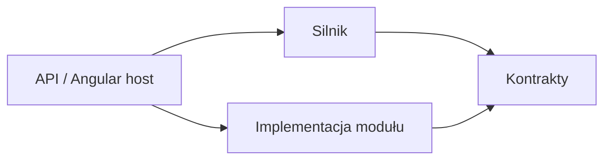

# Granica silnika i modułów

30 września 2026 · rozpoczęta implementacja fundamentu

Użytkownik wymaga mocnej granicy między silnikiem wyświetlającym materiały a modułami kampanii. Wprowadzamy osobne projekty .NET i osobno kompilowane biblioteki Angulara. Vertical slices pozostają sposobem organizacji przypadków użycia wewnątrz projektu odpowiedzialnego za daną funkcję.

Na MVP rekomendujemy jedno lokalne uruchomienie i wspólne wydanie. Pytanie o instalowanie modułów zawierających nowy kod bez aktualizacji aplikacji pozostaje otwarte. Wcześniejsze ustalenie zakładało dostarczanie nowych mechanik z aktualizacją aplikacji. Nie wdrożono dynamicznego loadera pluginów ani Module Federation.

## Pojęcia

**Silnik** zapewnia ogólne funkcje pracy z kampanią: czytnik, edycję, zapis, karty, hierarchiczną nawigację i wyświetlanie map. **Moduł** to implementacja kontraktu dostarczająca manifest, foldery, materiały, mapy, zasoby oraz własne reguły i narzędzia. **Kampania** to instancja utworzona z modułu, z własnymi materiałami i stanem rozgrywki.

**Ythryn** jest pierwszą konkretną implementacją modułu. Jego nazwa, materiały i Arcane Blight opisują zakres pilota. Inne moduły mogą dostarczyć inną hierarchię folderów, mapy i mechaniki bez zmian w czytniku. Nazwa konkretnego projektu `MasterCompanion.Modules.Ythryn` oznacza implementację, a nie nazwę abstrakcji.

## Zależności

Host jest jedynym miejscem, które składa konkretny silnik i konkretny moduł. Silnik nie odwołuje się do projektów ani nazw Ythryn. Moduł nie importuje implementacji silnika, jego komponentów, DbContext ani prywatnych plików. Moduły nie zależą od siebie.

| Obszar | Właściciel |
|---|---|
| Nawigacja materiałów, karty, czytnik, edytor i zapis | Silnik |
| Wyświetlanie mapy i otwieranie materiałów ze znaczników | Silnik |
| Foldery i ich hierarchia, treść, ilustracje map, pozycje i cele znaczników, materiał początkowy | Implementacja modułu |
| Reguły specyficzne dla przygody i interfejs jej narzędzi | Implementacja modułu; w pilocie Arcane Blight, jeszcze do implementacji |
| Neutralne typy folderów, materiałów i map, manifest, rejestracja narzędzi | Kontrakty |
| Rejestracja modułów, DI, procesy, połączenie z bazą | Host / Aspire |

## Backend

- `MasterCompanion.Contracts`: `ICampaignModule`, manifest i neutralne typy folderów, materiałów, map oraz zasobów. Nie zależy od EF Core, ASP.NET Core ani konkretnego modułu.
- `MasterCompanion.Engine`: neutralne slices odczytu, zapisu i inicjalizacji kampanii, własny model EF Core i schemat PostgreSQL `engine`. Zależy wyłącznie od kontraktów w obrębie rozwiązania.
- `MasterCompanion.Modules.<Nazwa>`: projekty konkretnych implementacji kontraktu modułu. Obecnie istnieje `MasterCompanion.Modules.Ythryn`, dostarczający manifest, hierarchię folderów, osadzone materiały i mapę. Zależy wyłącznie od kontraktów. Przyszłe slices i reguły pilota powstają w tym projekcie.
- `MasterCompanion.Api`: composition root. Rejestruje Ythryn jako implementację kontraktu i montuje neutralne endpointy silnika.

Silnik kopiuje materiały do kampanii przy pierwszym uruchomieniu. Moduł nie aktualizuje samodzielnie dokumentów użytkownika. Zasób mapy jest udostępniany przez kontrakt strumienia; silnik nie zna ścieżek plików modułu.

Źródła treści modułu są oddzielone od jego paczki wykonawczej. Konkretna implementacja przechowuje mały manifest, hierarchię folderów, definicje map i zasoby oraz osobne dokumenty Markdown z metadanymi YAML. Etap budowania waliduje źródła i kompiluje Markdown do istniejącego schematu dokumentu Tiptap. Wynikowy JSON jest artefaktem budowania, pomijanym przez Git; kompilacja projektu modułu osadza go w assembly. Silnik i kontrakty nadal otrzymują gotowe dokumenty, niezależnie od formatu źródeł. POC jest wyłącznie historycznym wejściem do jawnego importu, który nie może nadpisywać istniejących źródeł.

Kotwice nagłówków używają `{#id}`. Zwykły Markdown nie reprezentuje wszystkich struktur dokumentu; dla bezstratnego przeniesienia dopuszczamy kontrolowane bloki HTML, zwłaszcza zwijane fragmenty i niektóre tabele. Walidator odrzuca wykonywalny HTML i zewnętrzne odwołania. Zmiany w aplikacji zapisują kopię kampanii, bez zapisu do repozytorium modułu. Wizualne tworzenie modułów i aktualizowanie istniejących kampanii są odrębnym przyszłym zakresem. Bieżący build i testy nie wymagają usuniętego katalogu POC; opcjonalny import historycznej zawartości przyjmuje zewnętrzny plik HTML.

Folder ma stabilny identyfikator i opcjonalny identyfikator rodzica. Materiał wskazuje folder; nazwa grupy służy jedynie opisowi w czytniku. Hierarchia jest kopiowana do tabeli `engine.Folders`, a silnik sprawdza brak cykli i poprawność odwołań. Przy aktualizacji pierwszego fundamentu, który miał wyłącznie płaskie grupy, jednorazowo uzupełniamy foldery i przypisania istniejących materiałów. Ta aktualizacja metadanych nie zmienia dokumentów ani rewizji zapisu. Kolejne starty nie odtwarzają hierarchii z paczki.

Przed implementacją zegara i Arcane Blight należy ustalić kontrakt operacji gry: wspólny czas i cofanie muszą wywoływać reguły modułu przez jawny interfejs. Nie dodajemy wyjątków `if moduleId == ythryn` do silnika. Stan zarazy nie staje się kolumnami w ogólnym modelu bohatera. Sposób utrwalenia i atomowość zmiany czasu oraz stanu modułu wymagają sprawdzenia przy tym slice.

## Frontend

- `@mastercompanion/contracts`: DTO i manifest modułu, token rejestracji, typ rejestracji komponentu narzędzia.
- `@mastercompanion/engine`: czytnik, Tiptap, mapa, rekurencyjna nawigacja, karty, preferencja motywu i własne style. Zna kontrakty, nie importuje konkretnego modułu.
- Biblioteka konkretnego modułu: aktualnie `@mastercompanion/ythryn` z manifestem; docelowo również komponent Arcane Blight i jego komunikacja z API tego modułu.
- `src/main.ts`: host importujący publiczne API bibliotek i rejestrujący moduły.

Biblioteki są rzeczywiście budowane przez `ng-packagr`; aplikacja importuje wynik kompilacji przez publiczne entry points. Nie korzysta z aliasów do prywatnych katalogów źródłowych. Podczas rozwoju biblioteki przebudowujemy przed uruchomieniem hosta; zmiany w bibliotece wymagają ponownego uruchomienia `pnpm start`.

## Kontrola granic i przyszłe rozszerzenia

`pnpm check:boundaries` sprawdza referencje projektów .NET, zależności bibliotek, importy między bibliotekami i odwołania do Ythryn w silniku. Kontrola jest również uruchamiana przed kompilacją i startem frontendu. Zwykłe endpointy nadal wymagają odpowiednich testów; kontrola importów nie dowodzi kompletnej izolacji zachowania.

Mikrofrontendy uzasadnia potrzeba niezależnego budowania, dostarczania i aktualizowania kodu widoków. [Module Federation](https://webpack.js.org/concepts/module-federation/) łączy oddzielne buildy w działającej aplikacji; wymaga też zarządzania zależnościami współdzielonymi i ich wersjami. [Biblioteki Angulara](https://angular.dev/tools/libraries/creating-libraries) zapewniają osobne paczki i publiczne API bez ładowania kodu z oddzielnych wdrożeń. Wybór bibliotek na MVP jest rekomendacją wynikającą z lokalnego uruchomienia i budżetu, a nie rezygnacją z wymaganej granicy.

Jeśli potrzebne będzie instalowanie kodu bez przebudowy hosta, projekt obejmie wersjonowanie kontraktów, zgodność paczek, ładowanie i błędy inicjalizacji, migracje stanu oraz reguły zaufania do pluginów. Silne granice obecnego kodu pomagają w tym kierunku, ale nie oznaczają, że taka migracja będzie bezkosztowa.
