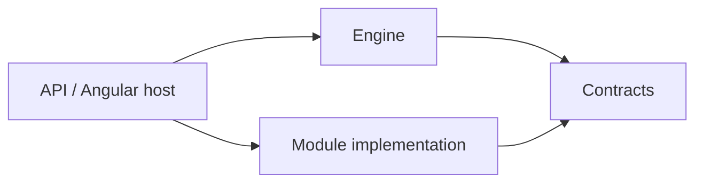

# Engine and module boundary

## Gameplay contract — 1 October 2026

The first gameplay slice uses `ICampaignGameRules` in `MasterCompanion.Contracts`. The engine owns elapsed minutes, party IDs, shared rest ends, revisions and transactionally stored snapshots and operation receipts. A module owns the schema, validation and transformation of its JSON state and its tool projection. Pure rules receive neutral snapshots; they never import engine persistence or EF Core. The API registers concrete implementations.

Campaign-scoped operations must atomically update time, module state, revision and history. Sequential undo restores the last active snapshot while advancing revision; material saves remain independent. Request IDs preserve the original receipt for safe retries and reject reuse with different input. See [the gameplay implementation plan](09-Gameplay-implementation.md) for delivery order and acceptance evidence.

30 September 2026 · foundation implementation started

The user requires a strong boundary between the material-rendering engine and campaign modules. We introduce separate .NET projects and separately compiled Angular libraries. Vertical slices remain the way to organize use cases within the project responsible for each feature.

For the MVP, we recommend one local runtime and a shared release. Installing modules containing new code without updating the application remains an open question. The earlier decision was to deliver new mechanics through application updates. No dynamic plugin loader or Module Federation has been implemented.

## Concepts

The **engine** provides generic campaign functionality: reading, editing, persistence, tabs, hierarchical navigation and map rendering. A **module** implements a contract supplying a manifest, folders, materials, maps, assets and its own rules and tools. A **campaign** is an instance created from a module, with its own materials and game state.

**Ythryn** is the first concrete module implementation. Its name, materials and Arcane Blight define the pilot's scope. Other modules can supply different folder hierarchies, maps and mechanics without reader changes. The concrete project name `MasterCompanion.Modules.Ythryn` identifies an implementation, not an abstraction.

## Dependencies

The host is the only place that composes the concrete engine and module. The engine does not reference Ythryn projects or names. A module does not import the engine implementation, its components, DbContext or private files. Modules do not depend on one another.

For the local Docker runtime, the API composition root also serves the compiled
Angular host from `wwwroot`, with same-origin `/api` endpoints and SPA navigation.
One application image contains both hosts; PostgreSQL remains a separate local
container using the campaign volume. This packaging does not change library or
module ownership. Aspire development retains separate frontend/API processes.
See [the Docker runtime record](10-Docker-local-runtime.md) for verification.

| Area | Owner |
|---|---|
| Material navigation, tabs, reader, editor and persistence | Engine |
| Map rendering and opening materials from markers | Engine |
| Folders and their hierarchy, content, map images, marker positions and targets, initial material | Module implementation |
| Adventure-specific rules and tool UI | Module implementation; Arcane Blight backend and frontend are implemented |
| Neutral folder, material and map types, manifest, tool registration | Contracts |
| Module registration, DI, processes, database connection | Host / Aspire |

## Backend

- `MasterCompanion.Contracts`: `ICampaignModule`, the manifest and neutral folder, material, map and asset types. It does not depend on EF Core, ASP.NET Core or a concrete module.
- `MasterCompanion.Engine`: neutral campaign read, save and initialization slices, its own EF Core model and PostgreSQL `engine` schema. Within the solution, it depends only on contracts.
- `MasterCompanion.Modules.<Name>`: projects implementing the module contract. The existing `MasterCompanion.Modules.Ythryn` supplies the manifest, folder hierarchy, embedded materials and map. It depends only on contracts. Future pilot slices and rules belong in this project.
- `MasterCompanion.Api`: the composition root. It registers Ythryn as the contract implementation and mounts neutral engine endpoints.

The engine copies materials into a campaign on first startup. The module does not update user documents independently. A stream contract exposes the map asset; the engine does not know module file paths.

Module content sources are separate from the runtime package. The concrete implementation maintains a small manifest, folder hierarchy, map definitions and assets, plus individual Markdown documents with YAML metadata. The build validates the sources and compiles Markdown into the existing Tiptap document schema. The resulting JSON is a build artifact ignored by Git; building the module project embeds it in the assembly. The engine and contracts still receive ready-to-use documents regardless of their source format. The POC is only a historical input to an explicit import that must not overwrite existing sources.

Heading anchors use `{#id}`. Plain Markdown cannot represent every document structure; controlled HTML blocks, especially collapsible sections and some tables, allow lossless transfer. The validator rejects executable HTML and external references. Application edits save the campaign copy without writing to the module repository. Visual module authoring and updates to existing campaigns are separate future work. Current builds and tests do not require the removed POC directory; optional historical content import accepts an external HTML file.

A folder has a stable ID and an optional parent ID. A material references its folder; the group name is only descriptive reader data. The hierarchy is copied into `engine.Folders`, and the engine validates references and rejects cycles. Updating the initial foundation, which only had flat groups, adds folders and assignments to existing materials through a one-time backfill. This metadata update changes neither documents nor save revisions. Subsequent startups do not rebuild the hierarchy from the package.

The gameplay contract is now `ICampaignGameRules`, with elapsed minutes, party and shared rest owned by the engine and versioned module JSON interpreted only by the module. `GameplayService` stores current snapshots and confirmed operation receipts under the `engine` schema. Transactions and campaign row locks protect time, module state, revisions and sequential undo together. Material documents remain outside this journal. Repeatable-read gameplay GETs keep current state and undo availability coherent; replayed receipts are validated before returning. The API is the composition root registering `YthrynGameRules`. No module-specific branch or disease column was added to the engine. Verification is recorded in [the gameplay plan](09-Gameplay-implementation.md).

`ICampaignGameRules.Upgrade` performs a pure upgrade of supported module JSON and
its schema version. The engine validates the original snapshot and rejects an
upgrade that changes engine time, party identity/names/order or rest history.
Current reads expose the supported version without writing; accepted operations
and undo persist the upgraded module state atomically. Stored idempotent receipts
are validated/described under their original supported schema and are never
rewritten to a different outcome. Ythryn accepts versions 1, 2 and 3; version 2
adds infected recovery every 12 hours or long rest with a reset timer. Historical
rest-only results remain intact. This changes module JSON, not EF tables.

Version 3 adds campaign-owned exploration checks and rival arrivals. Neutral
module operations may carry a bounded engine time advance, committed with module
state, revision and undo history. Ythryn alone interprets exploration, searches,
encounter tables and arrival triggers. Existing schema-two character recovery
history is preserved exactly; earlier exploration is not inferred from elapsed
time. The first recorded long rest and minute 1440 produce arrival reminders,
while actual arrival remains an explicit GM decision. See
[the priority delivery plan](12-Encounters-and-arrivals.md) for rules and evidence.

## Frontend

- `@mastercompanion/contracts`: DTOs and the module manifest, registration token and tool component registration type.
- `@mastercompanion/engine`: reader, Tiptap, map, recursive navigation, tabs, theme preference and its own styles. It knows contracts and does not import a concrete module.
- `@mastercompanion/ythryn`: manifest and lazily loaded Arcane Blight component, module projection validation, outcome commands and its own localization resources.
- `src/main.ts`: the host importing the libraries' public APIs and registering modules.

The libraries are built by `ng-packagr`; the application imports compiled output through public entry points. It does not use aliases into private source directories. During development, rebuild the libraries before starting the host; library changes require restarting `pnpm start`.

The frontend contracts now expose `GameStateDto`, `GameAction` and `GameToolContext` through the public entry point. The engine provides `CAMPAIGN_GAME` to a dynamically loaded module tool. Its signals supply confirmed state, pending status and operation availability; `execute` returns confirmed success. The module imports only contracts, validates its opaque projection and submits module commands without importing the engine's HTTP service or persistence implementation. The host still composes the libraries.

`GameToolContext.openMaterial(MaterialTarget)` delegates tool-to-reader navigation
through the engine game view to the workspace. The workspace validates campaign
material ownership, opens the existing material tab and scrolls to an optional
stable heading anchor. A module supplies its own rules material/anchor IDs and
localized link text without importing workspace or editor implementation. The
HTTP/recovery session remains independent of navigation.

The Ythryn expedition projection includes `pendingTable`: contiguous d100 bands
(`min`, `max`, `outcome`) for the oldest queued check, or null for an empty queue.
The backend derives these bands from the same outcome function used at
confirmation, including arrivals at the original check minute and the separate
patrol chance. The module frontend validates complete 1–100 coverage and known
outcome identifiers. Dice rolls, manual adjustments and repeated previews are
local inputs; only explicit confirmation submits the existing revision-protected
operation. No persisted schema or neutral engine contract changes are needed.
Module-owned pending summaries and warning icons derive from confirmed expedition
and character projections and link to the relevant tool controls.

Campaign party identity and roster editing belong to the engine and are available
to every registered module in a separate party tab. Tools refer to the confirmed
`snapshot.party` by stable character IDs through `GameToolContext`; names are
display data. Renaming and reordering retain those IDs. `updateParty` commits the
roster, module state, revision and undo receipt together. The pure module contract
`ReconcileParty(before, proposed)` preserves state for retained IDs, initializes
additions at current game time and removes deleted IDs. Undo restores the full
previous roster and module snapshot. Removing the last character preserves clock
and long-rest history; later additions start at the current time.

Registered content modules without adventure gameplay rules use strict neutral
rules for party, time and undo. Only schema version 1 with an empty object is
accepted; missing rules never discard unfamiliar saved state. Long rest advances
480 minutes and records a recovery deadline. Short rest advances 60 minutes
without a long-rest entry. The 30-minute building-search shortcut is an ordinary
engine time advance; adventure outcomes remain module-owned.

`GameSession` owns revision coordination and recovery. It copies and validates each action, preserves the exact request ID and body in tab session storage before POST, and allows only one dependent operation at a time. An uncertain outcome blocks other writes and permits explicit replay of that same request, including after page reload. Original receipts are followed by a current-state GET; an older receipt never becomes visible current state. Conflicts require explicit refresh. Storage or response failures do not claim success, and destruction cancels I/O while leaving the recovery request intact. Module tools keep local input associated with the current check identity.

Markdown insertion and material-link selection belong to the engine editor. They insert through the supported schema at the captured selection, require explicit edit mode and use the existing material autosave/revision path. Markdown is bounded to 65,536 characters, escapes raw HTML and rejects images, external links and unknown campaign targets. Existing rich blocks remain intact; cancelled or rejected Markdown stays recoverable in the mounted material view. This campaign editing path does not edit authored module sources.

## Boundary checks and future extensions

`pnpm check:boundaries` checks .NET project references, library dependencies, cross-library imports and references to Ythryn in the engine. The check also runs before frontend builds and startup. Regular endpoints still need appropriate tests; import checks do not prove complete behavioral isolation.

Microfrontends are justified by a need to build, deliver and update view code independently. [Module Federation](https://webpack.js.org/concepts/module-federation/) combines separate builds in a running application and requires managing shared dependencies and their versions. [Angular libraries](https://angular.dev/tools/libraries/creating-libraries) provide separate packages and public APIs without loading code from separate deployments. Choosing libraries for the MVP follows from local operation and the budget; the required boundary remains intact.

If installing code without rebuilding the host becomes necessary, the design will need contract versioning, package compatibility, loading and initialization errors, state migrations and plugin trust rules. The current code's strong boundaries help with that direction but do not make such a migration cost-free.

## Campaign-owned note creation — 3 October 2026

The generic engine creates ordinary materials independently of module defaults.
`POST /api/campaigns/{campaignId}/materials` accepts a client-generated UUID,
normalized title and optional existing campaign folder. The server owns the
canonical `note-{UUID}` identity, empty schema-1 document, initial revision,
group presentation data and append ordering. The endpoint bounds JSON input to
8 KiB/depth 4 and rejects unsupported fields, duplicate properties and invalid
campaign/folder references. No persistence schema or module contract changes
are required.

A creation UUID identifies one immutable title/folder request in this slice.
An exact retry, including a concurrent retry, returns the current persisted
material without resetting its document or revision. Different metadata returns
a stable conflict. Rename/move are outside this slice; adding them later requires
immutable creation receipts or an equivalent explicit idempotency design.

The frontend public contract exports CreateMaterialRequest. The engine owns the
creation dialog and campaign-scoped tab-session recovery request. Only confirmed
materials enter navigation and the ordinary reader/editor lifecycle; existing
sessions and drafts stay mounted. Creation and later autosave are independent of
game time, module state and game undo. Unfiled presentation is localized in the
frontend rather than persisted as UI text. Details and verification are in
[the campaign-note delivery plan](14-Campaign-notes.md).
