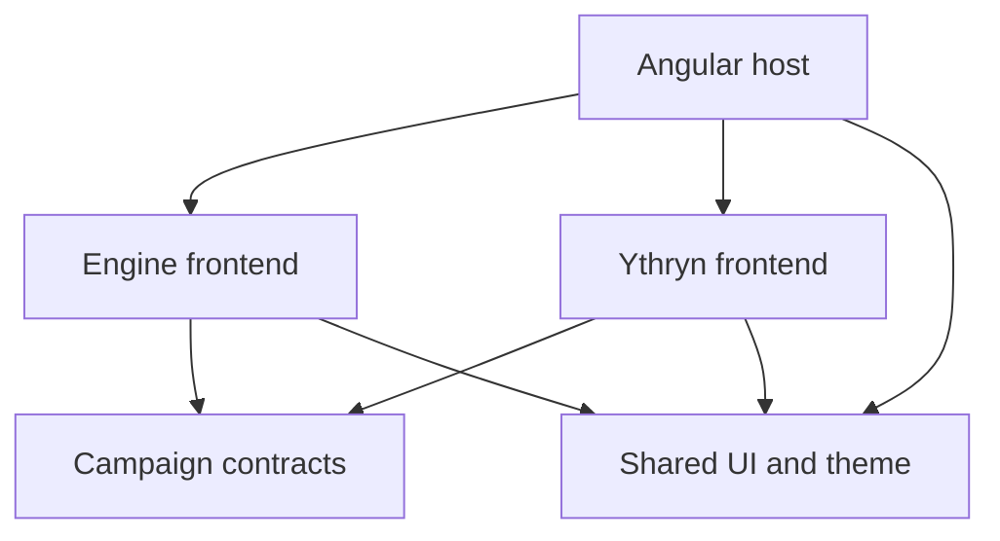

# Reusable frontend UI

3 October 2026 · architecture and delivery proposal; context menu foundation delivered on 4 October

## Intent

The user clarified that "materials" means an application-owned library of
reusable UI elements. Build a small `@mastercompanion/ui` library from patterns
already used in the application. This name avoids confusion with campaign
materials in the engine's `features/materials` area. Choosing a third-party UI
framework is not part of this proposal.

Related: [engineering instructions](../../AGENTS.md),
[module architecture](06-Module-architecture.md), and
[code quality review](16-Code-quality-review.md).

## Ownership and dependencies



The UI library imports no engine, adventure module, campaign contracts, HTTP
client, or persistence implementation. Framework dependencies belong in its
explicit package manifest. Contracts remain independent of the UI library.
Consumers import only supported public entry points; no cross-library private
source imports. This extends the frontend boundary while leaving .NET unchanged.

There are three distinct levels of reuse:

| Level | Owner | Examples |
| --- | --- | --- |
| Neutral presentation and interaction | UI | Theme tokens, dialog shell, feedback message, button behavior, generic tab controls |
| Campaign functionality | Engine feature | Material sessions, editor schema, workspace tabs, folder navigation, game-operation recovery |
| Adventure functionality | Module | Blight checks, encounter tables, rival arrival tools, rules-material references |

A reusable material reader still belongs to the engine. Do not move campaign
materials into the UI library or require modules to import engine components.
The existing contracts remain the channel for module-to-engine interaction.

## Candidates supported by current code

Names below describe responsibilities, not finalized component APIs.

| Candidate | Current consumers/evidence | Shared responsibility | Retained feature responsibility |
| --- | --- | --- | --- |
| Dialog shell/controller | `game-view.ts`, `party-view.ts`, `material-creation-dialog.ts`, insertion dialog in `material-view.ts` | Modal lifecycle, accessible title, initial focus, return focus, close request, common layout | Revision-sensitive confirmation, pending-operation policy, form validation, draft preservation |
| Feedback message | Gameplay and party recovery banners, creation errors, workspace errors, module projection errors | Consistent severity/presentation, accessible announcements, projected action area | Localized error mapping, retry/discard rules, request execution |
| Action-required indicator | `ythryn-tools.ts` and `expedition-tool.ts` use module-local `action-required.ts` | Icon, emphasis, neutral warning presentation | Which game events require attention and their module-specific labels |
| Tab controls | Four tab variants repeated in `workspace.ts` | Keyboard navigation, selected/focus state, accessible names, close/middle-click interaction | Open sessions, save-before-close, active material ownership, mounted panel state |
| Duration presentation | Formatting in `workspace.ts`, `game-view.ts`, `blight-tool.ts`, and `expedition-tool.ts` | Render a minute duration consistently using localized labels | Time limits, advancement, rests, arrival/check chronology |
| Theme and style tokens | Global rules in `engine.scss` and variables consumed by Ythryn styles | Colors, spacing, typography, control states, focus and contrast | Campaign layout and editor-generated document styling |

Start with dialogs and feedback because they have multiple real consumers and
repeated interaction/presentation. Tab extraction is valuable but requires
additional care around mounted panels and unsaved sessions.

Native HTML buttons and fields can initially share tokens/styles or a directive.
Do not create a wrapper component for every HTML element. Add a component when
it provides meaningful behavior or a stable shared structure.

## Proposed organization

```text
projects/ui/
  src/
    public-api.ts
    lib/
      dialog/
      feedback/
      action-required/
      tabs/
      duration/
    styles/
      tokens.scss
      base.scss
```

This illustrates the target owners. Create each feature directory only when it
has a delivered consumer; do not pre-create empty components or placeholders.
Each component has its own TypeScript, substantial HTML, styles, and focused
tests. Public exports are deliberate and documented.

Keep feature-specific components beside their features, for example material
toolbars/insertion forms under engine materials and the folder tree under engine
workspace. A component shared inside one feature does not need public export.

## Design rules

- Favor composition with projected body/actions and typed inputs/outputs over
  a universal JSON-driven form, page, or modal system.
- Separate visual severity from announcement behavior. A warning does not
  automatically require an assertive live region; static messages need not be
  re-announced on every render. Avoid nested live regions.
- A dialog emits a close request and supports an explicit feature-owned close
  policy. Opening, Escape, cancel, and programmatic completion must preserve
  focus predictably. Domain confirmation remains in its feature.
- UI components receive localized copy or projected content. Any built-in UI
  labels use matching locale resources. Do not import engine/module messages.
- Keep pending, disabled, selected, and error states explicit. Prefer native
  semantics and ensure pointer and keyboard interactions are equivalent.
- Share duration formatting without interpreting game snapshots or depending
  on wall-clock time/time zones. Supply localized unit labels explicitly.
- Feature callbacks retain ownership of saves and recovery. Material autosave,
  material-creation idempotency, and gameplay-operation recovery are different
  contracts; do not merge them into a generic save-session base class.
- Keep reader/editor styles in the engine when they target generated document
  content. Host-owned global tokens should be available to both libraries;
  module appearance must not require loading an unrelated engine feature's CSS.
- Each extraction replaces duplicate implementations in its selected consumers.
  Do not retain an unused shared component beside the original copies.

## Delivery stages

1. Establish the test runtime and formatter/lint configuration identified in the
   code-quality review so subsequent extractions have reliable checks.
2. Add the separately compiled UI library with theme tokens, public entry point,
   package/host configuration, and permitted dependency directions. Update the
   dependency guard, build/start scripts, and test-server source tracking before
   introducing consumer imports. Verify fresh builds do not use stale output.
3. Deliver feedback and dialog primitives with at least two migrated consumers.
   Move the neutral action-required indicator out of Ythryn when the shared
   library foundation is ready. Preserve module rules and labels.
4. Extract tab presentation/interaction and workspace state ownership separately.
   Preserve mounted editors, map pan/zoom, selected folders, and save-before-close.
   Coordinate this slice with [planned URL-based navigation](15-Near-term-improvements.md#improvement-url-based-workspace-navigation),
   recorded on 4 October 2026. Routing activates workspace sessions; neutral UI
   controls do not own route resolution or session persistence.
5. Consolidate duration presentation and remaining proven UI duplication.

Deliver one coherent slice at a time; do not migrate all screens in a single
unreviewable rewrite. Dates and exact slice boundaries are not yet set.

## Component catalog

Maintain a local developer catalog showing delivered components and their real
inputs/outputs. Include light/dark themes and applicable focus, disabled,
pending, error, empty, and long-text examples. Show multiple component instances
to expose duplicate DOM IDs and focus ownership errors. Keep catalog content
and developer diagnostics in English.

Use a minimal local development surface unless a documentation framework has
a demonstrated maintenance benefit. Do not add a user-facing application menu
or production feature solely for the catalog. Choose its build integration in
the first UI delivery slice. The catalog documents working components, not
speculative variants.

## Acceptance and verification

- Engine and Ythryn consume shared elements through the UI public API; the UI
  library has none of the forbidden application dependencies.
- There is a real reuse benefit: migrated consumers remove duplicate code while
  retaining their feature-specific operation decisions.
- Type-check real implementations and tests. Use focused component integration
  tests for dialog focus/Escape/pending policy and tab keyboard behavior.
- Verify the full frontend build for the new library/build boundary, together
  with code/localization and dependency guards. Add checks for UI resources and
  dependencies to the existing guards rather than bypassing them.
- Run only affected browser checks and review intentional screenshot changes
  in both themes at Full HD. Verify migrated forms and feedback at the existing
  smaller viewport. Do not update baselines without reviewing the images.
- Preserve notes, drafts, revisions, operation recovery, tab state, and map
  pan/zoom; frontend reuse does not require database changes.
- Document component APIs, actual consumers, checks run, and remaining scope.

The original planning task changed instructions and architecture documentation only.
No UI library, new dependency, application behavior, or visual baseline has
been implemented or verified by this document.

On 4 October 2026, [the quality implementation](19-Code-quality-implementation.md)
extracted the engine-owned `WorkspaceMaterials` session owner and a shared
`WorkspaceTab` view used by the party, gameplay, map and material tabs. These
campaign controls remain internal to the engine and do not create the planned
neutral UI library. UI library scaffolding, its catalog, and URL routing remain
separate planned slices.

On 4 October 2026, folder management introduced the separately compiled
`@mastercompanion/ui` foundation and its first neutral context-menu interaction
primitive. Folder, material and tab consumers retain their campaign decisions in
the engine. Dependency guards, public aliases, build/start order and the UI test
source cache enforce the new boundary. A separate loopback developer catalog
documents light/dark, focus, disabled and long-label states. See the
[context menu API and catalog](17-Context-menu-catalog.md). Dialog, feedback,
theme and tab extractions remain planned; they are not part of this slice.
